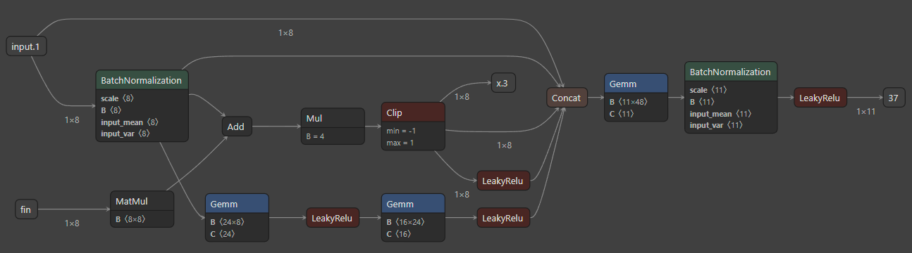

# Hardware Aware Nonlinear Audio Processor Modeling for Free-Spoken Digit Classification
This repository contains the materials for Thelonious Cooper's final project for the MIT Fall 2024 class: 6.s965 Digital Systems Laboratory II.

A novel model is architected to address the problem of free-spoken digit classification with fewer parameters than methods in literature

This model is trained via hybrid Bayesian optimization before being exported to ONNX format and quantized.

A novel HLS system then implements the ONNX operator graph as a SystemVerilog Module in Q4.8 (12 bit fixed point) format

This module is verified via CocoTB against the GPU-native PyTorch Model

## Architecture
One step of the recurrent network is outlined below. `x.3` is fed back in as `fin` to the next iteration
